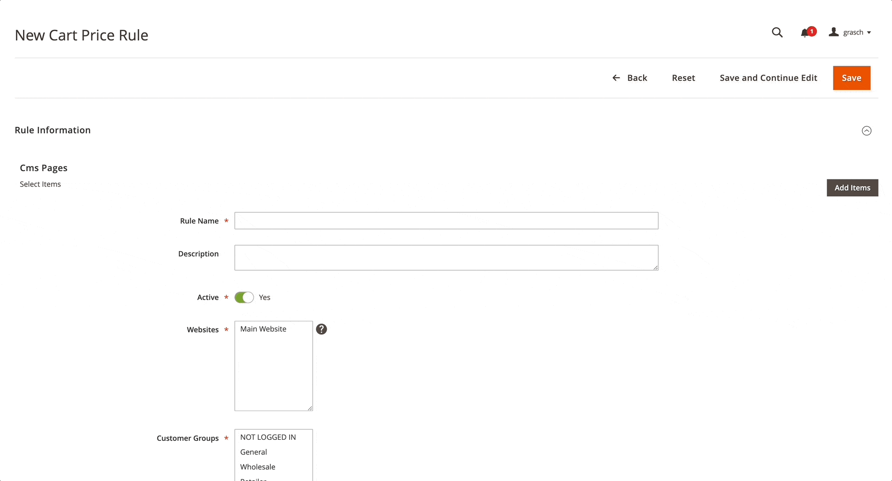
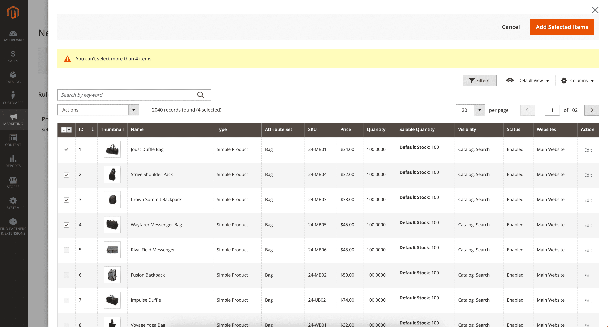
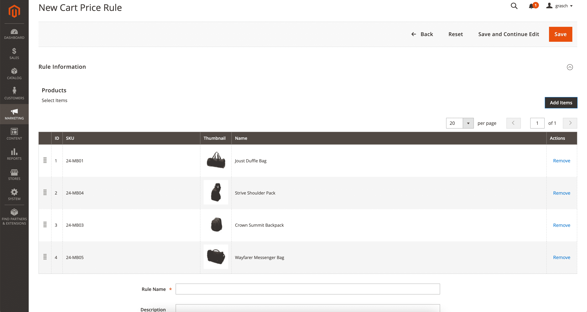
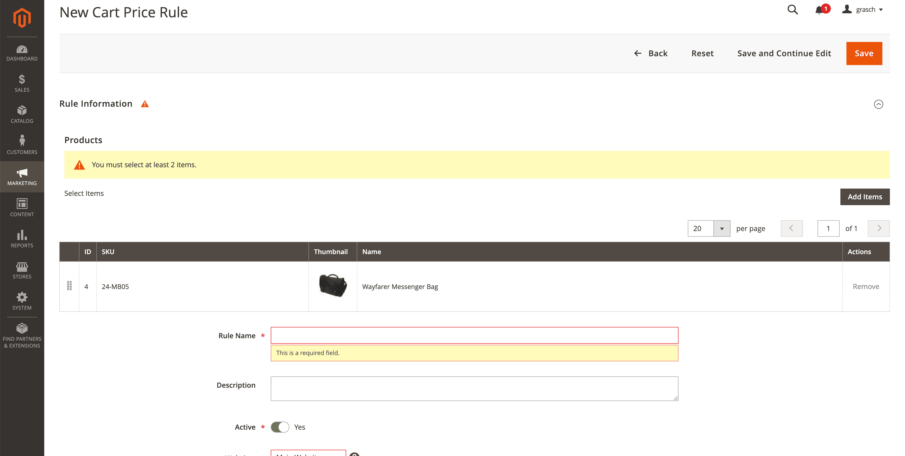

<h1>Entities Selector UI Component</h1>

The Entities Selector makes it easy to create component with the same functionality as 'Related Products, Up-Sells, and Cross-Sells' on the product form.



## What are the benefits?
- You don't need to write PHP code. Add only the Entities Selector component to the XML.
- You can use any listings (product_listing, cms_page_listing, customer_listing, etc).
- Easy to configure.

## Options
### General options
Options | Description                                               | Type    | Default | Is Required
--- |-----------------------------------------------------------|---------|---------| --- 
`namespace` | The name of the XML file with listing                     | string  | `null`  | `true`
`columnsName` | The name of the columns component in the listing          | string  | `null`  | `true`
`selectionsColumnName` | The name of the selectionsColumn component in the listing | string  | `null`  | `true`
`label` | Caption for an component                                  | string  | `null`  | `true`
`grid/columns` | Array of columns                                          | array   | `[]`    | `true`
`grid/columns/{columnName}` | Column configuration array                                | array   | `[]`    | `true`
`grid/dndEnabled` | Enable/Disable drag and drop functionality                | boolean | `true`  | `false`
`limit/min` | Minimum limit                                             | number  | `null`  | `false`
`limit/max` | Maximum limit                                | number | `null`  | `false`

### Column configuration options
Options | Description                       | Type    | Default | Is Required
--- |-----------------------------------|---------| --- | --- 
`original_name` | The name of the column in the grid | string  | `null` | `true`
`type` | Type (text, thumbnail)            | string  | `null` | `true`
`label` | Heading for a column              | string  | `null` | `true`
`fit` | Сolumn width                      | boolean | `null` | `true`
`sortOrder` | Column sort order                 | number  | `null` | `true`


## Examples

### 1. Add component to Sales Rule form. (Listing: cms_page_listing).

```xml
<form xmlns:xsi="http://www.w3.org/2001/XMLSchema-instance" xsi:noNamespaceSchemaLocation="urn:magento:module:Magento_Ui:etc/ui_configuration.xsd">
    ...
    <fieldset>
        ...
        <component name="cms_pages" class="Grasch\AdminUi\Component\EntitiesSelector" component="Grasch_AdminUi/js/view/components/entities-selector">
            <argument name="data" xsi:type="array">
                <item name="config" xsi:type="array">
                    <item name="label" xsi:type="string">Cms Pages</item>
                    <item name="namespace" xsi:type="string">cms_page_listing</item>
                    <item name="columnsName" xsi:type="string">cms_page_columns</item>
                    <item name="selectionsColumnName" xsi:type="string">ids</item>
                    <item name="grid" xsi:type="array">
                        <item name="columns" xsi:type="array">
                            <item name="id" xsi:type="array">
                                <item name="original_name" xsi:type="string">page_id</item>
                                <item name="type" xsi:type="string">text</item>
                                <item name="label" xsi:type="string">ID</item>
                                <item name="sortOrder" xsi:type="number">10</item>
                                <item name="fit" xsi:type="boolean">false</item>
                            </item>
                            <item name="identifier" xsi:type="array">
                                <item name="original_name" xsi:type="string">identifier</item>
                                <item name="type" xsi:type="string">text</item>
                                <item name="label" xsi:type="string">identifier</item>
                                <item name="sortOrder" xsi:type="number">20</item>
                                <item name="fit" xsi:type="boolean">false</item>
                            </item>
                            <item name="is_active" xsi:type="array">
                                <item name="original_name" xsi:type="string">is_active</item>
                                <item name="type" xsi:type="string">text</item>
                                <item name="label" xsi:type="string">Is Active</item>
                                <item name="sortOrder" xsi:type="number">15</item>
                                <item name="fit" xsi:type="boolean">true</item>
                            </item>
                        </item>
                    </item>
                </item>
            </argument>
        </component>
        ...
    </fieldset>
    ...
</form>
```

### 2. Add component to Sales Rule form. (Listing: product_listing, Min: 2, Max: 4).
```xml
<form xmlns:xsi="http://www.w3.org/2001/XMLSchema-instance" xsi:noNamespaceSchemaLocation="urn:magento:module:Magento_Ui:etc/ui_configuration.xsd">
    ...
    <fieldset>
        ...
        <component name="products" class="Grasch\AdminUi\Component\EntitiesSelector" component="Grasch_AdminUi/js/view/components/entities-selector">
            <argument name="data" xsi:type="array">
                <item name="config" xsi:type="array">
                    <item name="limit" xsi:type="array">
                        <item name="min" xsi:type="number">2</item>
                        <item name="max" xsi:type="number">4</item>
                    </item>
                    <item name="label" xsi:type="string">Products</item>
                    <item name="namespace" xsi:type="string">product_listing</item>
                    <item name="columnsName" xsi:type="string">product_columns</item>
                    <item name="selectionsColumnName" xsi:type="string">ids</item>
                    <item name="grid" xsi:type="array">
                        <item name="columns" xsi:type="array">
                            <item name="id" xsi:type="array">
                                <item name="original_name" xsi:type="string">entity_id</item>
                                <item name="type" xsi:type="string">text</item>
                                <item name="label" xsi:type="string">ID</item>
                                <item name="sortOrder" xsi:type="number">10</item>
                                <item name="fit" xsi:type="boolean">true</item>
                            </item>
                            <item name="sku" xsi:type="array">
                                <item name="original_name" xsi:type="string">sku</item>
                                <item name="type" xsi:type="string">text</item>
                                <item name="label" xsi:type="string">SKU</item>
                                <item name="sortOrder" xsi:type="number">15</item>
                                <item name="fit" xsi:type="boolean">false</item>
                            </item>
                            <item name="name" xsi:type="array">
                                <item name="original_name" xsi:type="string">name</item>
                                <item name="type" xsi:type="string">text</item>
                                <item name="label" xsi:type="string">Name</item>
                                <item name="sortOrder" xsi:type="number">20</item>
                                <item name="fit" xsi:type="boolean">false</item>
                            </item>
                            <item name="thumbnail" xsi:type="array">
                                <item name="original_name" xsi:type="string">thumbnail_src</item>
                                <item name="type" xsi:type="string">thumbnail</item>
                                <item name="label" xsi:type="string">Thumbnail</item>
                                <item name="sortOrder" xsi:type="number">16</item>
                                <item name="fit" xsi:type="boolean">true</item>
                            </item>
                        </item>
                    </item>
                </item>
            </argument>
        </component>
        ...
    </fieldset>
    ...
</form>
```
### Results



